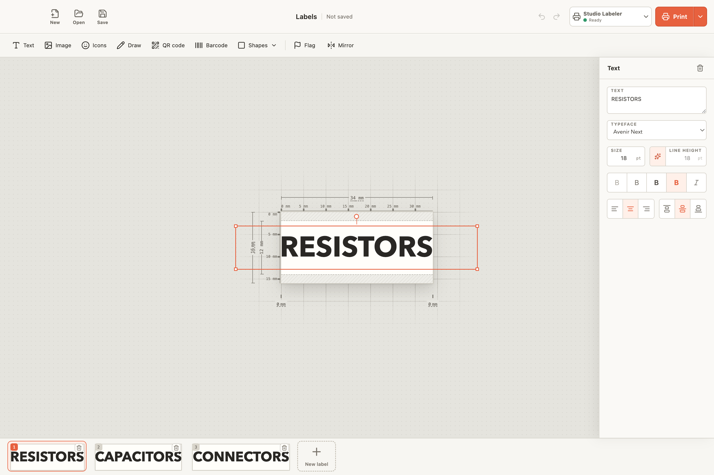
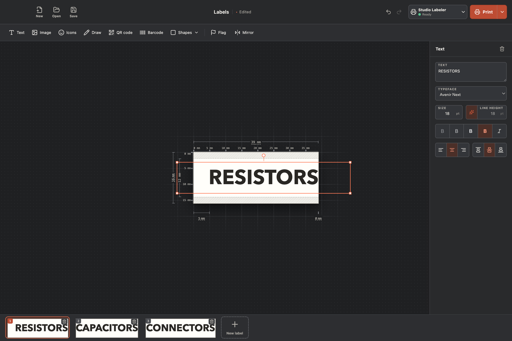
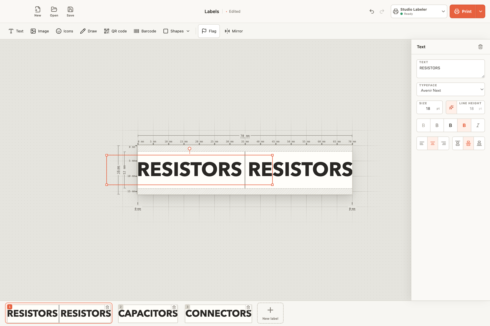
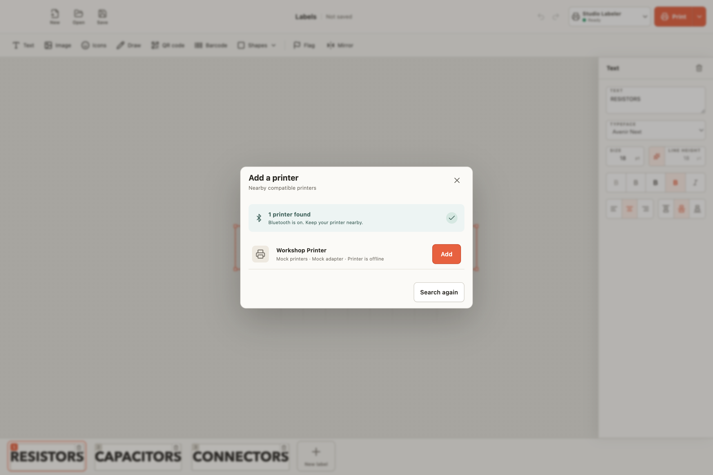

# Labelmaker

Labelmaker is a source-available label editor for desktop and iPad. One `.lbl`
workspace can contain many labels. The editor can create text, image, and shape
elements. It can also set label size and margins, trim a label to its printed
content, make cable flags, and print through a printer adapter.

The desktop app uses Electron. The iPad app uses the same React editor in a
native Swift shell. Printer adapters keep Bluetooth and printer protocols out
of the editor and document model.

## Screenshots

<p align="center">
  
</p>

<p align="center">
  
  
</p>

<p align="center">
  
</p>

These screenshots use test printer fixtures. Normal app sessions do not show
mock printers.

## Current status

- The macOS desktop app can discover and print to a MakeID E1 through Bluetooth
  Low Energy. The physical print path is verified on 16 mm tape.
- The shared MakeID adapter also detects L1 203-DPI, L1 300-DPI, and P31-family
  profiles from printer replies. These profiles need physical tests on the
  ordered L1 300-DPI and P31S printers.
- The iPad app has Files integration, workspace recovery, touch controls, and a
  native CoreBluetooth transport for supported MakeID profiles. The iPad
  printer path still needs a physical hardware test.
- The editor can run on Windows and Linux, but these systems do not yet have a
  physical printer transport.
- Signed install packages are not available. Run the apps from source.
- Mock printers are available only for tests, screenshots, and the demo video.

See [the roadmap](docs/roadmap.md) and the
[MakeID adapter notes](packages/adapters/makeid/README.md) for the open work and
hardware test results.

## Development

Use Node 24 and npm 11 or later.

```bash
npm install
npm run dev
npm run check
```

`npm run check` runs formatting, React Doctor, TypeScript, tests, and builds.
React Doctor must report a score of 100 and no diagnostics.

For iPad setup and Xcode commands, see [the iPad guide](apps/ipad/README.md).

## Visual artifacts

Run the screenshot task only after a material UI change:

```bash
npm run ui:screenshot
```

The task checks all desktop scenes and keeps seven representative screenshots.
The four screenshots used in this README stay in the repository. Other generated
screenshots stay ignored by Git.

Run the demo video task only when you need a new video:

```bash
npm run ui:video
```

The task installs the Playwright FFmpeg tool when it is not present. It then
records this flow: add a test printer, add a label, edit its text, change the
typeface, size, and weight, trim it to content, and print it. The mouse pointer
is visible. The task writes `artifacts/videos/labelmaker-demo.webm`. Git ignores
this file, and the normal check does not run the video task.

## Add support for a printer

New printers must use Bluetooth Low Energy or Bluetooth Classic. There are two
ways to request support.

### Make a pull request

Read [the contribution guide](CONTRIBUTING.md),
[the adapter contract](docs/adapter-contract.md), and
[the architecture](docs/architecture.md). Then:

1. Add a separate package under `packages/adapters/<name>`.
2. Accept the shared one-bit raster format. Do not read editor state or `.lbl`
   files in the adapter.
3. Put Bluetooth and operating-system code behind the adapter transport.
4. Add fixed protocol vectors, discovery filter tests, and fake transport
   tests before a hardware test.
5. Add an opt-in hardware test report. State the exact printer model, firmware,
   host system, Bluetooth type, tape or label size, and test result.
6. Register the adapter in each supported app shell and make a focused pull
   request.

Do not add device addresses, private captures, credentials, or vendor binaries
to the repository.

### Send hardware to the maintainer

If you do not want to make an adapter, send the maintainer a direct message.
State the exact printer model, the Bluetooth type, and the host system that you
want to use. You can arrange to send one working printer and enough compatible
labels or tape for discovery, status, repeated print, and error tests. Send all
shipping details only in the direct message.

## Repository map

```text
apps/desktop             Electron shell, files, recovery, and macOS transport
apps/ipad                Swift iPad shell, Files access, and CoreBluetooth
apps/server              Future headless API and local print bridge
packages/domain          Workspace, label, element, and unit types
packages/documents       Workspace validation and gzip YAML serialization
packages/printing        Printer adapter contracts, sessions, and jobs
packages/rendering       Shared SVG and one-bit raster rendering
packages/adapters/mock   Test-only printer adapter
packages/adapters/makeid MakeID model profiles, protocols, and transports
packages/ui              Shared React editor and application UI
docs                     Product, architecture, format, and test documents
```

Labelmaker uses the [Functional Source License 1.1 with the MIT Future
License](LICENSE). Each version becomes available under the MIT License two
years after that version is made available.
