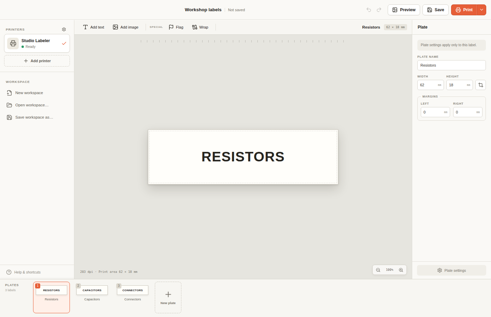

# Labelmaker Universal

Labelmaker Universal is a portable desktop label editor with independent
printer adapters. A document can contain many label plates. Users can design,
save, preview, and print each plate without exposing printer protocol details to
the editor.

The first target is an Electron application for macOS, Windows, and Linux. The
same core can later run behind a local or container-hosted print service.

## Screenshots

<p align="center">
  
</p>

<p align="center">
  
  
</p>

<p align="center">
  
</p>

The mock shows movable elements, multi-label workspaces, plate sizing and
margins, trim-to-content, special label layouts, and printer discovery. Physical
MakeID E1 printing is not yet verified.

## Repository map

```text
apps/desktop             Electron shell and desktop composition root
apps/server              Future headless API and print bridge
packages/domain          Saved document and plate types
packages/documents       Workspace validation and JSON serialization
packages/printing        Printer adapter contracts and registry
packages/rendering       Deterministic RGBA-to-monochrome raster conversion
packages/adapters/mock   Safe adapter for UI and orchestration tests
packages/adapters/makeid Hardware-independent MakeID E1 protocol candidate
packages/ui              Shared desktop editor UI
docs                     Product, architecture, and format specifications
```

## Development

Use Node 24 and npm 11 or later.

```bash
npm install
npm run dev
npm run check
```

The desktop application has no real printer dependency during UI development.
The mock adapter supplies predictable printers, capabilities, states, and print
results.

## Current status

The foundation and interactive desktop mock are complete. The desktop shell can
create, open, validate, save, and save a copy of workspace files. The application
still uses the mock adapter only. A deterministic raster package and an
unverified, transport-injected MakeID E1 protocol adapter are present for later
hardware integration. See `docs/roadmap.md`.

The project uses the Apache-2.0 license. Signed desktop distribution is
planned for macOS, Windows, and Linux, including a separate Mac App Store build.
The signing identity is not configured in this repository. See
`docs/distribution.md`.
